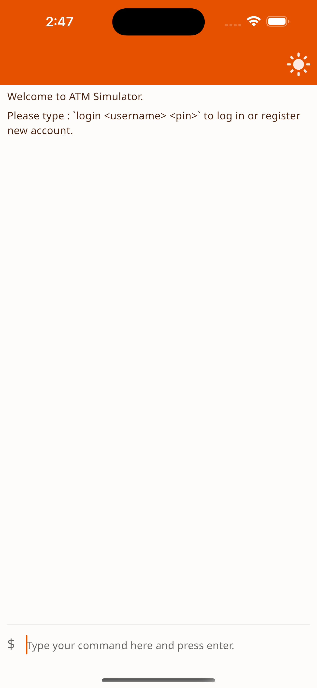
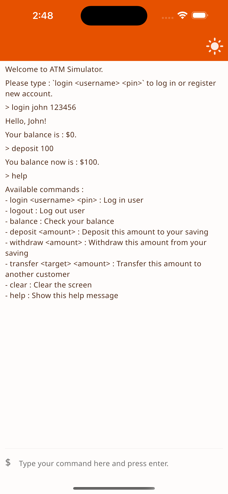

<div align="center">
  <a href="">
    
  </a>

<h3 align="center">ATM Simulator</h3>
</div>

<details>
  <summary>Table of Contents</summary>
  <ol>
    <li>
      <a href="#about-the-project">About The Project</a>
      <ul>
        <li><a href="#features">Features</a></li>
        <li><a href="#built-with">Built With</a></li>
      </ul>
    </li>
    <li>
      <a href="#getting-started">Getting Started</a>
      <ul>
        <li><a href="#prerequisites">Prerequisites</a></li>
        <li><a href="#installation">Installation</a></li>
      </ul>
    </li>
    <li>
      <a href="#usage">Usage</a>
        <ul>
          <li><a href="#log-in-to-bank-account">Log In to Bank Account</a></li>
          <li><a href="#log-out-from-current-active-account">Log Out from Current Active Account</a></li>
          <li><a href="#check-account-balance">Check Account Balance</a></li>
          <li><a href="#deposit-money-to-account">Deposit Money to Account</a></li>
          <li><a href="#withdraw-money-from-account">Withdraw Money from Account</a></li>
          <li><a href="#transfer-money-to-another-account">Transfer Money to Another Account</a></li>
          <li><a href="#show-list-of-commands">Show List of Commands</a></li>
          <li><a href="#clear-screen">Clear screen</a></li>
        </ul>
    </li>
    <li><a href="#contact">Contact</a></li>
  </ol>
</details>

## About The Project

<p align="center">
    
    
</p>

This Flutter application is designed to simulate ATM transactions using Command-Line-Interface (CLI) as the input method. It allows users to perform basic banking tasks such as checking account balance, withdrawing, depositing, and transfer to another account.

<p>&nbsp;</p>

### Features

- Log in or create new account
- Log out from active account
- Check account balance
- Deposit money to account
- Withdraw money from account
- Transfer money to another account
- Show help of the available commands
- Clear screen

<p>&nbsp;</p>

### Built With

[![Flutter][flutter]][flutter-url]

<p>&nbsp;</p>

## Getting Started

### Prerequisites

- [Flutter 3.7.0 or above][flutter-url]
- [Android Studio 2022.1.1 or above][android-studio]
- [Xcode 14.2 or above][xcode]

<p>&nbsp;</p>

### Installation

1. Install and Set up [Flutter][flutter-install-url]).
2. Set up the the [IDE][flutter-ide-setup-url].
3. Unzip the project archive.
4. Go to the project directory.
   ```sh
   cd atm_simulator
   ```
5. Install flutter packages.
   ```sh
   flutter pub get
   ```
6. Launch Android Simulator or iOS Simulator.
7. Run the app
   ```sh
   flutter run
   ```

<p>&nbsp;</p>

## Usage

### Log In to Bank Account

- `login [username] [pin]`
- `username` should be 3 to 10 characters and lowercase alphanumeric.
- `pin` should be 6 digits numeric.
- This will automatically create new account if the username does not exists.

```sh
> login irwan 123456
Hello Irwan!
Your balance is $0.
```

### Log Out from Current Active Account

- `logout`

```sh
> logout
Good bye, Irwan!
```

### Check Account Balance

- `balance`

```sh
> balance
Your balance is $0.
```

### Deposit Money to Account

- `deposit [amount]`

```sh
> deposit 100
Your balance now is $100.
```

### Withdraw Money from Account

- `withdraw [amount]`

```sh
> withdraw 80
Your balance now is $20.
```

### Transfer Money to Another Account

- `transfer [target_username] [amount]`

```sh
> transfer cindy 15
Your balance now is $5.
```

- Make sure `target_username` account was created or transfer will fail.

```sh
> transfer depp 15
Transfer failed. Target customer not found.
```

### Show List of Commands

- `help`

```sh
> help
Available commands :
- login [username] [pin] : Log in customer account
- logout : Log out customer account
- balance : Check account balance
- deposit [amount] : Deposit this amount to account
- withdraw [amount] : Withdraw this amount from account
- transfer <target> [amount] : Transfer this amount to another account
- clear : Clear the screen
- help : Show this help message
```

### Clear screen

- `clear`
- This will show welcome message if no account is logged in when running this command.

```sh
Welcome to ATM Simulator.
Please type : 'login [username] [pin]' to log in or register new account.
```

### Debt

- If your account balance is not enough to make a transfer of required amount, it will automatically create a debt between you and target account.

```sh
> login irwan 123456
Welcome back, Irwan!
Your balance is $100.

> transfer cindy 125
Transferred $100 to Cindy.
Your balance now is $0.
You owed $25 to Cindy.

> logout
Good bye, Irwan!

>login cindy 123456
Welcome back, Cindy!
Your balance is $100.
Owed $25 from Irwan.
```

- If you make a deposit while having a debt, the deposit will be used pay the debt.
- The amount left after all debt is paid will be deposited to your account.

```sh
> login irwan 123456
Welcome back, Irwan!
Your balance is $0.
You owed $25 to Cindy.

> deposit 20
Transferred $20 to Cindy.
Your balance now is $0.
You owed $5 to Cindy.

> deposit 10
Transferred $5 to Cindy.
Your balance now is $5.
```

- if someone owed you and you make a transfer to them, your transfer amount will be used to deduct their debt. The amount of transfer left will be sent to their account.

```sh
> login irwan 123456
Welcome back, Irwan!
Your balance is $140.
Owed $100 from Cindy.

> transfer cindy 80
Your balance now is $60.
Owed $20 from Cindy.

> transfer cindy 50
Transferred $30 to Cindy.
Your balance now is $10.
```

<p>&nbsp;</p>

## Contact

[![LinkedIn][linkedin-shield]][linkedin-url]
[![Github][github-shield]][github-url]

<p>&nbsp;</p>

[app-screenshot-1]: screenshot/screenshot_1.png
[app-screenshot-2]: 'screenshot/screenshot_2.png'
[linkedin-shield]: https://img.shields.io/badge/LinkedIn-0077B5?style=for-the-badge&logo=linkedin&logoColor=white
[linkedin-url]: https://linkedin.com/in/irwancheung
[github-shield]: https://img.shields.io/badge/GitHub-100000?style=for-the-badge&logo=github&logoColor=white
[github-url]: https://github.com/irwancheung
[flutter]: https://img.shields.io/badge/Flutter-%2302569B.svg?style=for-the-badge&logo=Flutter&logoColor=white
[flutter-url]: https://flutter.dev
[flutter-install-url]: https://docs.flutter.dev/get-started/install
[flutter-ide-setup-url]: https://docs.flutter.dev/get-started/editor
[android-studio]: https://developer.android.com/studio
[xcode]: https://developer.apple.com/xcode/
